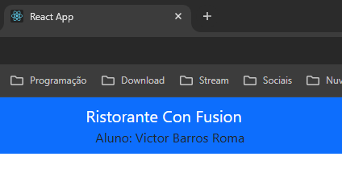

Repositório destinado ao estudo de **react** 

# Aula 07 - 21/11/2024

### 1. Instalação do reactstrap e Bootstrap
Foi utilizado os comandos:
- npm install reactstrap react react-dom
- npm install --save bootstrap
- npm install react-popper @popperjs/core

### 2. Configuração do Bootstrap
No arquivo index.js foi adicionado o import do bootstrap
- import 'bootstrap/dist/css/bootstrap.min.css';

### 3. Adicionado barra de navegação ao projeto
- A barra de navegação é utilizada para fazer a navegação do site entre as paginas do projeto, redirecionamento para outros locais ou seja formas de facilitam a navegação pela pagina para o usuario acessar as informações desejadas de forma simples, pratica e responsiva.

### 4. Atualização do README
- Informativo das modificações realizadas no projeto

# Aula 09 - 25/11/2024

### 1. Criação da pasta **assets** na pasta public e adicionado imagens a pasta

### 2. Criação da pasta **components** na pasta src 

### 3. Criação e configuração do arquivo MenuComponent.js na pasta components

### 4. Alteração no arquivo App.js
- Adicionado as seguintes instruções 
import Menu from './components/MenuComponent';
. . .
<Menu />

